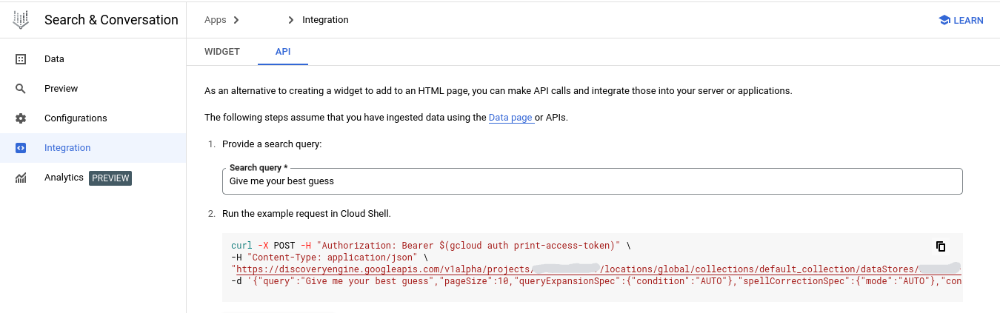

# Discovery Engine Sample
The Google .NET SDK includes classes for interacting with the Vertex Search & Converation.  The API is in the DiscoveryEngine library and is discoverable from within the GCP Console through the **Integration** tab:



```bash
curl -X POST -H "Authorization: Bearer $(gcloud auth print-access-token)" \
    -H "Content-Type: application/json" \
    "https://discoveryengine.googleapis.com/v1alpha/projects/xxxxxxx/locations/global/collections/default_collection/dataStores/yyyyy/servingConfigs/default_search:search" \
    -d '{"query":"Give me your best guess","pageSize":10,"queryExpansionSpec":{"condition":"AUTO"},"spellCorrectionSpec":{"mode":"AUTO"},"contentSearchSpec":{"summarySpec":{"summaryResultCount":5,"ignoreAdversarialQuery":true,"includeCitations":true},"snippetSpec":{"returnSnippet":true},"extractiveContentSpec":{"maxExtractiveAnswerCount":1}}}'
```

## Getting Started

Ensure you have set `GOOGLE_APPLICATION_CREDENTIALS` environment variable to point to your service account key file.  See this [guide](https://cloud.google.com/docs/authentication/getting-started) for more details.

Set project and datastore values in `appsettings.Development.json`.

Run the app in development mode to read those settings with:
```bash
DOTNET_ENVIRONMENT=Development dotnet run
```

### Prerelease Google SDK Packages
This application is using a pre-release version of the Google.Cloud.DiscoveryEngine APIs, specfivially `1.0.0-beta09`.  To install a pre-release version of the APIs, run:

```bash
dotnet add package --version 1.0.0-beta09 Google.Cloud.DiscoveryEngine.V1Beta  
```

Or to grab the latest prerelease just add the `--prerelease` flag and notice that the namespace is `V1Beta` instead of `V1`.


```bash
dotnet add package --prerelease Google.Cloud.DiscoveryEngine.V1Beta  
```
